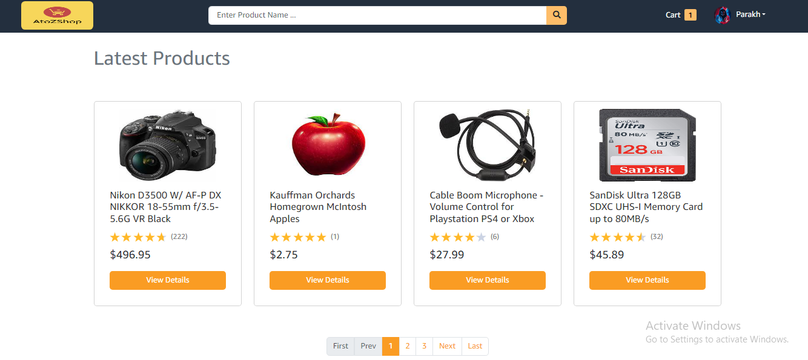
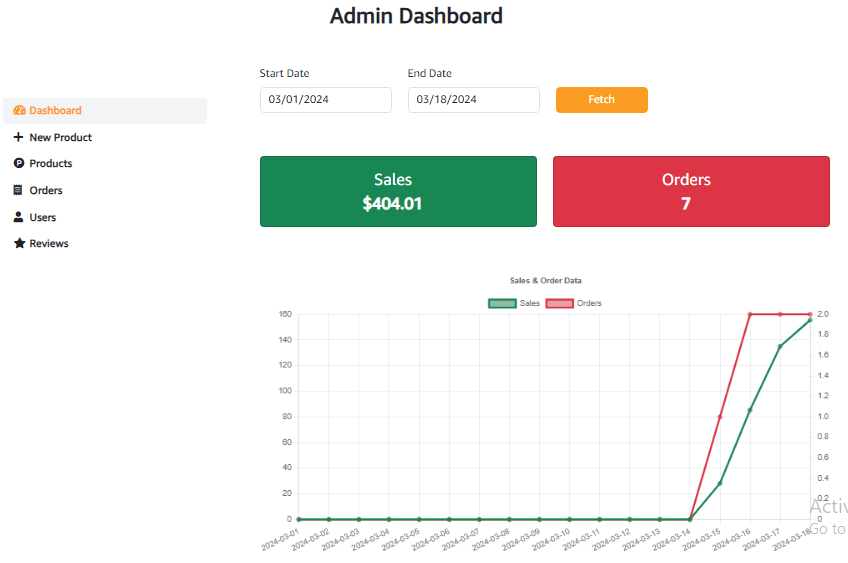
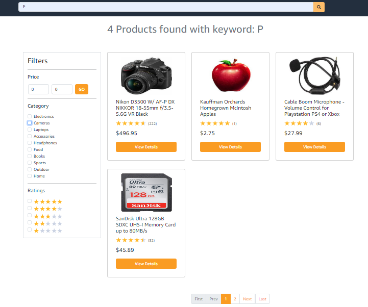
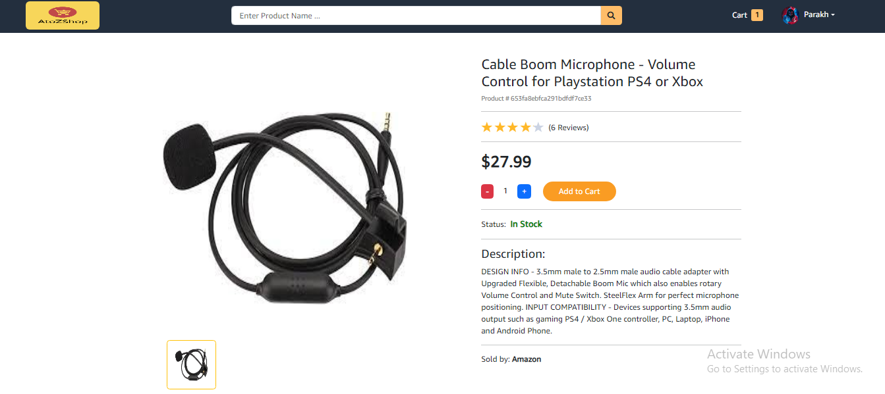
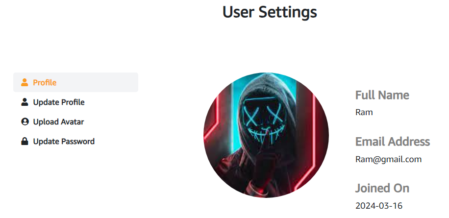

# AtoZShop

Welcome to AtoZShop! This project is a MERN-based E-commerce platform developed with advanced features, user authentication, and Stripe payment integration for seamless transactions.

 #### Home:
 

 #### Admin Dashboard:
 

 #### Filter Functionality:
 

 #### Product Detail:
  

 #### User Profile:
  

- **User Authentication:** Users can sign up, log in, and manage their profiles securely.
- **Stripe Payment Integration:** Seamlessly process transactions using Stripe payment gateway.
- **Admin Dashboard:** Admins have access to a dedicated dashboard to manage products, orders, and user data.
- **Product Management:** Easily add, update, or delete products through the admin interface.
- **User Reviews:** Allow users to leave reviews and ratings for products.
- **Third-Party Image Uploads:** Support for uploading images from third-party services.
- **Environment Variables:** The project uses environment variables for configuration, facilitating easy deployment and customization.

## Technologies Used:

- **MongoDB:** NoSQL database used for storing product, user, and order data.
- **Express.js:** Backend framework for building RESTful APIs and handling requests.
- **React:** Frontend library for building dynamic user interfaces.
- **Node.js:** JavaScript runtime environment for executing server-side code.
- **Stripe API:** Payment gateway integration for processing transactions securely.
- **JWT:** JSON Web Tokens used for authentication and authorization.
- **Bootstrap:** Frontend framework for responsive design and styling.

## Getting Started:

   1. **Clone the Repository:** `git clone https://github.com/parakh80/AtoZShop.git`
2. **Install Dependencies:**
   - Backend: `cd AtoZShop/backend && npm install`
   - Frontend: `cd AtoZShop/frontend && npm install`
3. **Set Environment Variables:**
   - Create a `.env` file in the backend directory and add necessary environment variables.
4. **Run the Development Server:**
   
    ***Backend:***
- **For production:**
  - Go to the config file and change `NODE_ENV` to `PRODUCTION`.
  - Run `npm start`.
- **For development:**
  - Go to the config file and change `NODE_ENV` to `DEVELOPMENT`.
  - Run `npm start`.

   ***Frontend:***
   - Run `npm start` in the frontend directory.

5. **Open Your Browser:** Visit http://localhost:3000 to view the application.
 
6. **Adding Products to Database:**
   - Navigate to `backend -> models -> product.js`.
   - Comment out the `User` object in `productSchema` to avoid user validation errors when adding products to the database.
   - In the backend console, run `npm run seeder` to add products to the database.

## Deployment:

1. **Build the React App:** `npm run build` in the frontend directory.
2. **Deploy the Backend:** Deploy the backend server to your preferred hosting platform.
3. **Deploy the Frontend:** Deploy the built React app to a static hosting service like Vercel or Netlify.
4. **Set Environment Variables:** Configure environment variables on your hosting platform for production deployment.
